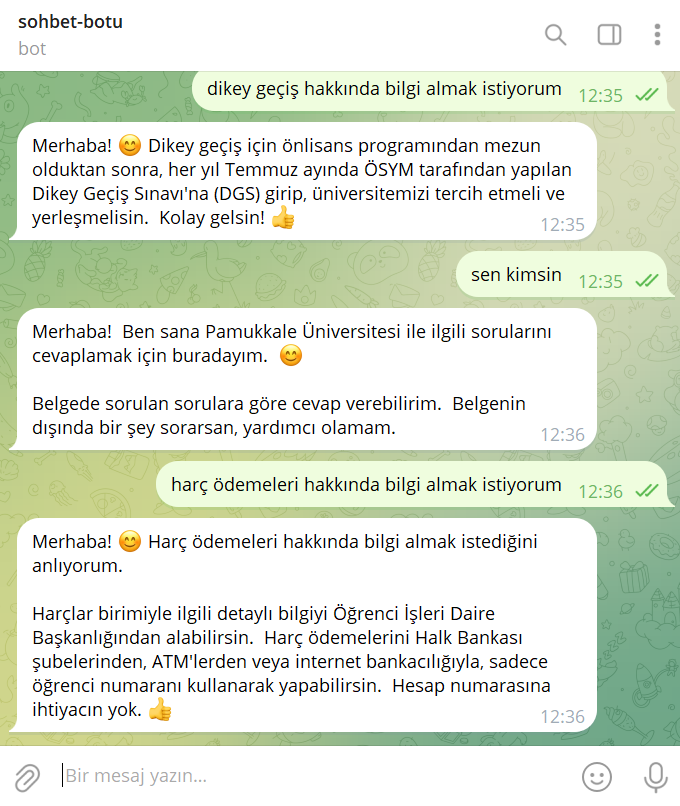

# Telegram Soru-Cevap Botu



Bu proje, Google'ın Gemini AI modelini kullanarak Telegram üzerinden soru-cevap yapabilen bir chatbot uygulamasıdır. Bot, önceden hazırlanmış bir Excel dosyasındaki bilgileri kullanarak kullanıcıların sorularına yanıt verir.

## Özellikler

- Telegram üzerinden soru-cevap desteği
- Gemini AI entegrasyonu
- Excel dosyasından veri okuma ve işleme
- Chroma veritabanı ile vektör tabanlı arama
- Türkçe dil desteği

## Kurulum

1. Projeyi klonlayın:
```bash
git clone [repo-url]
cd [repo-name]
```

2. Gerekli paketleri yükleyin:
```bash
pip install -r requirements.txt
```

3. `.env` dosyası oluşturun ve gerekli API anahtarlarını ekleyin:
```
TELEGRAM_API_KEY=your_telegram_api_key
GOOGLE_API_KEY=your_google_api_key
```

4. `soru_cevaplar.xlsx` dosyasını projenin kök dizinine ekleyin.

## Kullanım

Botu başlatmak için:
```bash
python bot.py
```

## Gereksinimler

- Python 3.8+
- Telegram Bot API anahtarı
- Google AI API anahtarı
- Excel dosyası (soru_cevaplar.xlsx)

## Güvenlik

- `.env` dosyasını asla GitHub'a pushlamayın
- API anahtarlarınızı güvende tutun
- Excel dosyasını güncel tutun
